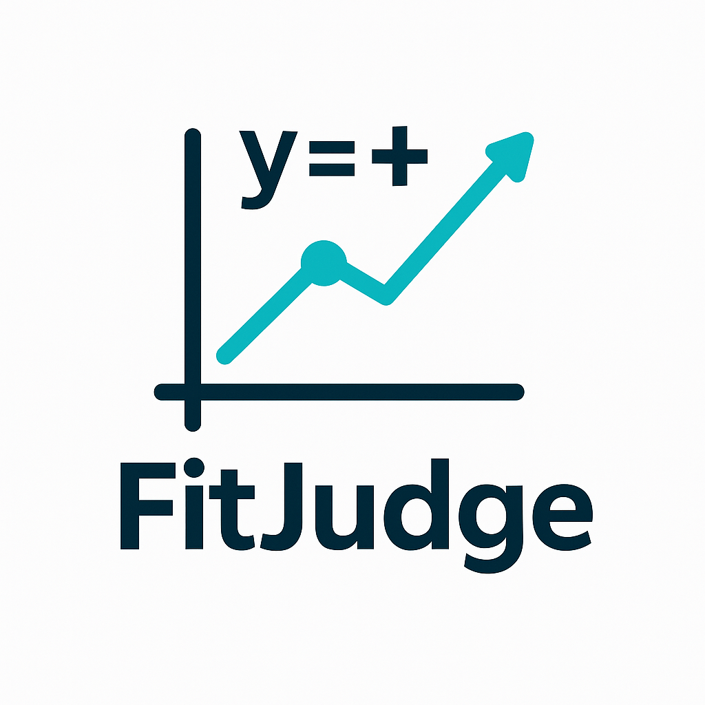

# FitJudge

     
    
     

## 当一个新的文件来的时候怎么预测效果呢？
先由prompt生成raw_data,
（同一个版本只需要生成一次raw_data,然后在赋值给其他的）

然后在由pred生成code

然后在进行评估

## data存放的文件
`raw_llm`:从llama-factory拷贝来的热乎的预测结果

`llm_with_data`:由`raw_llm`调用llm进行生成数据json

`llm_with_data_code`:由`llm_with_data`再生成每个样本的结果代码

## output存放的文件
`logs`：日志

`results`：评估结果

## 指标

`mse`:

`mae`:

`rmse`:

`步骤完整性`:

`逻辑一致性`:

`分析清晰度`: